# 쿠버네티스

- 컨테이너를 `쉽고 빠르게 배포 및 확장`하고 `관리를 자동화`해주는 오픈소스 플랫폼

 

## 컨테이너의 특징

- 가상머신과 비교하여 컨테이너 생성이 쉽고 효율적임
- 컨테이너 이미지를 이용한 배포와 롤백이 간단함
- 언어나 프레임워크에 상관없이 애플리케이션을 동일한 방식으로 관리
- 개발/테스팅/운영 환경은 물론 로컬 피시와 클라우드까지 동일한 환경을 구축
- 특정 클라우드 벤더에 종속적이지 않음

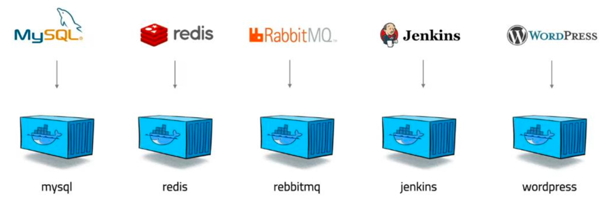

MySQL등을 컨테이너화 해서 기동시키는 것을 많이 활용하고 있음
 
- 또한 우리가 구축하고자하는 웹 사이트의 규모에 따라서 여러개의 웹 애플리케이션으로 만들 수 있음 (Micro Service)
  => 유지 보수가 용이함

- springedu, springedu2 등은 각각의 애플리케이션이라 볼 수 있음

 

(가상머신을 이용하는 것은 게스트 운영체제를 추가로 설치해야하므로 저장소도 많이 사용하고 기동할 떄 메모리나 CPU 사용량이 많음)

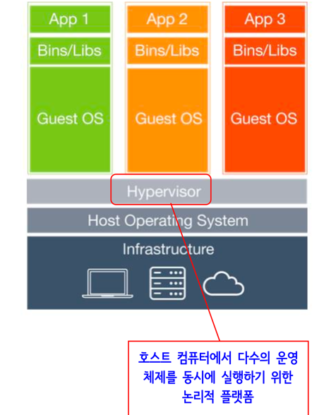

 

## 컨테이너 구축 과정

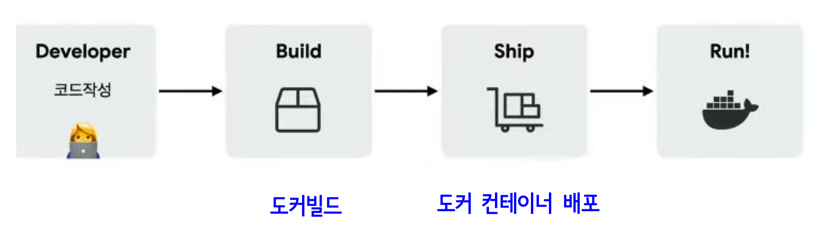

1. 개발자가 개발
2. 빌드 (소스를 가지고 뭔가를 수행할 수 있는 구조로 만드는 것)
- 어떤 구성방식이냐에 따라서 빌드 과정이 다름
  - 뷰 프로젝트의 빌드와 스프링부트 프로젝트의 빌드 과정은 다름
  - 여기서의 빌드는 도커 빌드를 뜻함

3. 도커 컨테이너 배포 (도커 컨테이너화)
4. 실행

## 도커 컨테이너 시나리오

- 각각의 앱이 각각의 도커 컨테이너로 구성되어있음

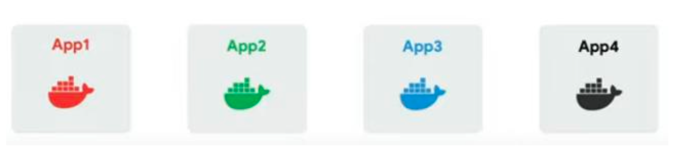

 

- 유저 수가 많아져서 컨테이너를 늘림

- 각 기능을 분산해서 처리할 수 있는 앱들을 늘림
- 기능을 컬러에 맞게 늘리기 위해 (이미지는 이미 있으므로 이미 존재하는 이미지에 맞춰서) 컨테이너만 늘려주면 됨
- 수강생이 요청할 경우 a가 바쁘면 b에게 넘겨주는 방식등으로 작동함

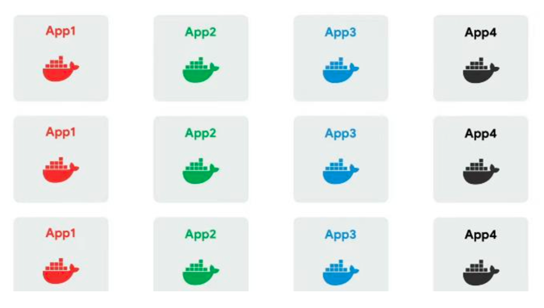

 

- 각각의 일을 하는 컨테이너가 점점 늘어남
- 너무 늘어났으므로 관리가 필요함

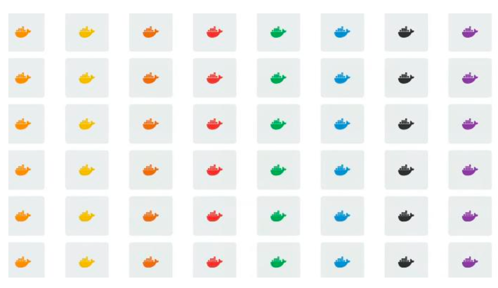

 

- 컨테이너를 이용해서 사이트 작업시 관리 작업이 필요해짐

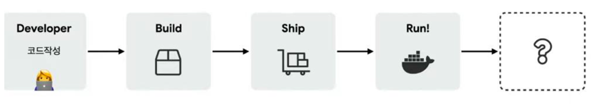

### 컨테이너 시나리오 관련 관리 작업

- 시스템 구축 자동화
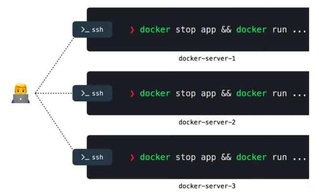

 

- `유휴 시스템 파악`

- 문제가 발생한 컨테이너가 발생할 수 있음
- 따라서 모니터링 및 관리해주는 무엇인가가 필요함
- 관리해주는 프로그램이 필요함

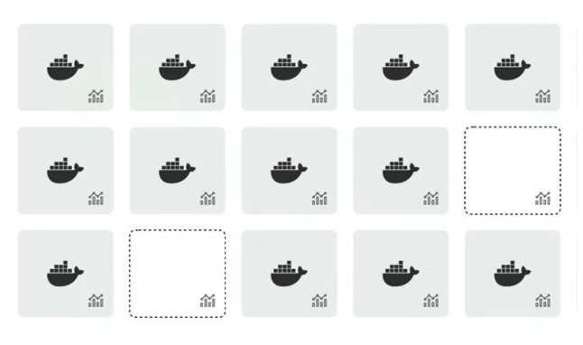

 

- `버전 관리`
- 버전 변경을 위해 하나를 죽였을 때 프로그램이 다 죽으면 안되므로 버전을 분리해서 관리

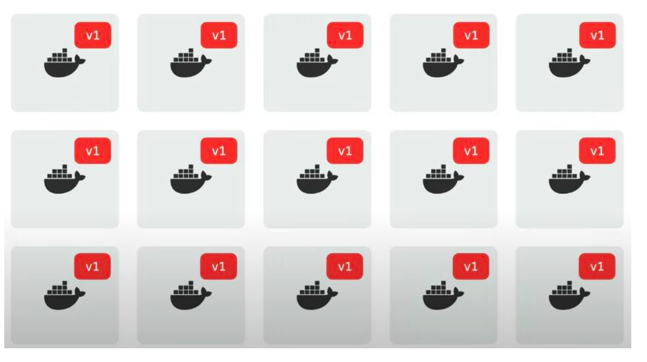
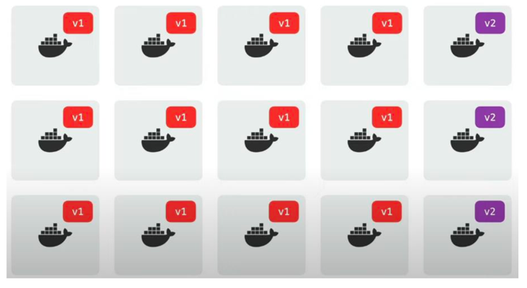
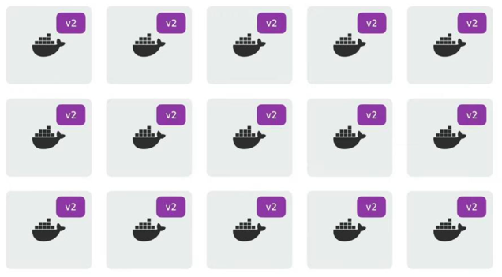

 

- 컨테이너를 외부에 공개하지 않기 위해 Proxy 서버를 둠
- 외부에서는 Proxy 서버에 요청하면 얘가 컨테이너에 요청을 해서 응답을 받고 이를 클라이언트에 전달

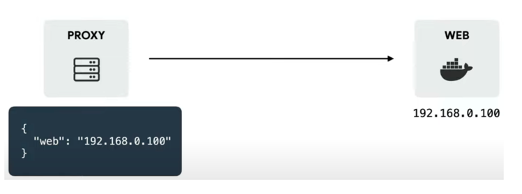

 

- 사업이 잘 되어서 서비스하는 컨테이너를 늘림

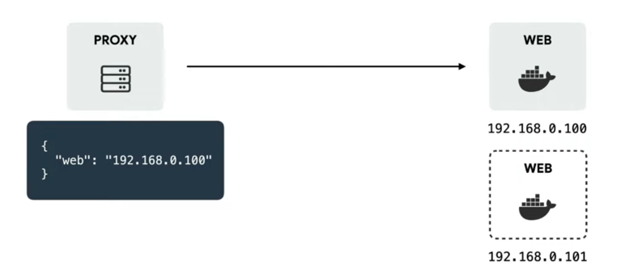

 

- 앞에 로드밸런서를 두어서 프록시가 로드밸런서에 요청하면 두개의 컨테이너 중 노는 애들에게 요청을 보냄
- 이 과정을 쿠버네티스가 수행해줌

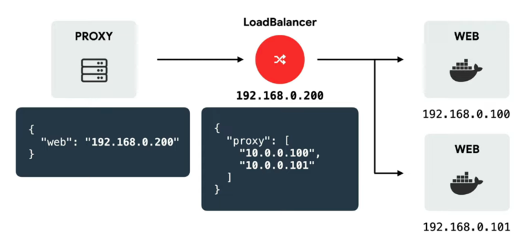

 

- 클라이언트가 도메인 명을 어떻게 주느냐에 따라서 컨테이너에게 어떤 일을 시키느냐에 대한 자동화 과정이 필요함
- 이는 쿠버네티스를 통해 구현이 가능

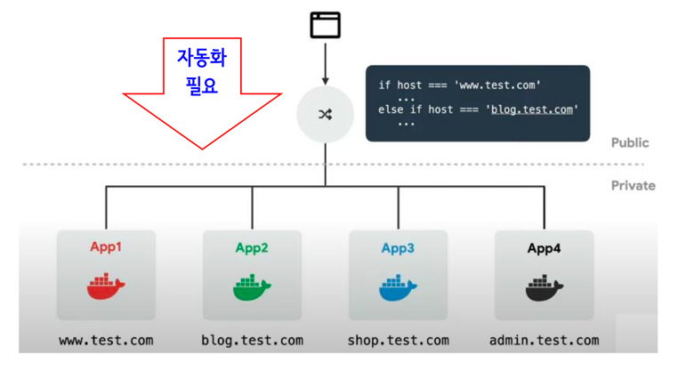

 

- `서비스 이상, 부하 모니터링`
- 죽은 컨테이너를 감지
- 하나의 컨테이너가 죽으면 다른 애를 자동으로 기동시켜주는 프로그램이 필요함
- 이러한 작업은 쿠버네티스를 통해 실현할 수 있음

 

- 죽은 것은 아니지만 response time이 오래걸리면, status를 죽은것은 아니지만 load가 오래걸리는 작업으로 판단
- 이러한 과정에서 우리가 해주어야하는 컨테이너에 대한 관리가 필요함
- 이때 사용되는 기술이 `컨테이너 오케스트레이션`

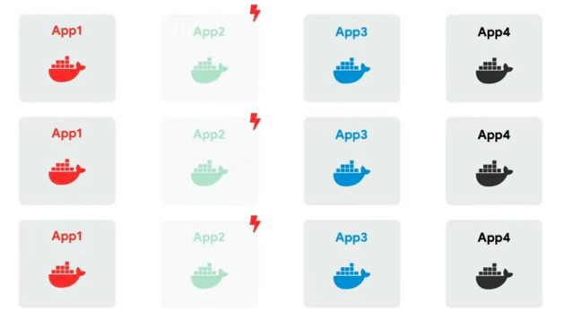
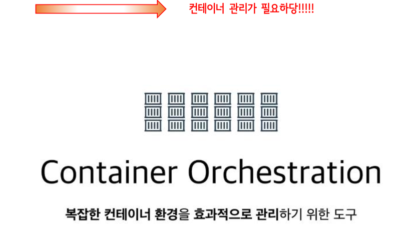

 

## 컨테이너 오케스트레이션

- 복잡하고 수많은 컨테이너 환경을 효과적으로 관리하기 위한 제어 체계(도구)
- 컨테이너화 된 애플리케이션에 대한 자동화된 설정, 관리 및 제어 체계

- 오케스트레이션
  - `컴퓨터 자원과 어플리케이션, 서비스에 대한 자동화된 설정, 관리 및 제어 체계`를 뜻함

- 쿠버네티스가 컨테이너 오케스트레이션을 지원함

### 컨테이너 오케스트레이션 지원 툴

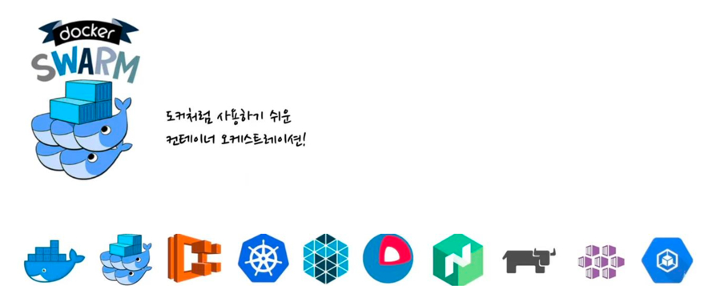

이들 중 쿠버네티스가 표준이 되었음

 

## 쿠버네티스의 탄생

- 구글에 의해 생겨남

 

- 수많은 컨테이너의 자동화 및 관리를 담당하는 `컨테이너 오케스트레이션`임

  

## 클라우드 환경에서의 애플리케이션 배포

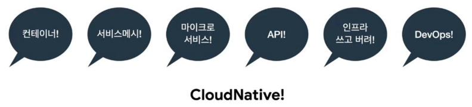

- `CloudNative`
  - 클라우드 컴퓨팅을 활용하여 "퍼블릭, 프라이빗 및 하이브리 드 클라우드와 같은 현대적이고 역동적인 환경에서 확장 가능한 애플리케이션을 구축하
    고 실행"하는 소프트웨어 개발 접근 방식

 

 

## 쿠버네티스와 클러스터 구축과 동작 방법

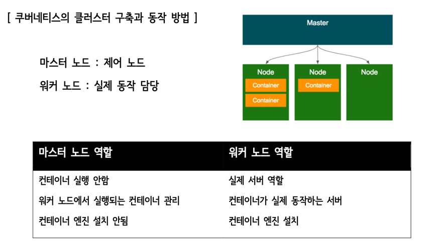
규모에 따라 마스터 노드와 워커 노드를 다르게 구성

- 마스터 노드
  - 워커 노드를 관리

- 워커 노드
  - 컨테이너의 수행 담당

 

- 클러스터는 설정 파일의 내용에 따라 자율적으로 동작함

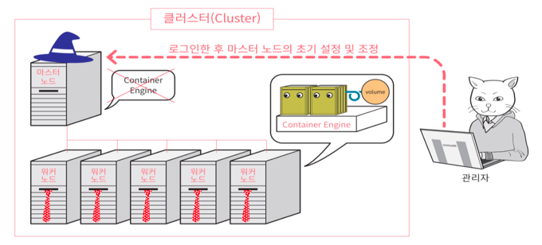

 

## 쿠버네티스의 동작 과정

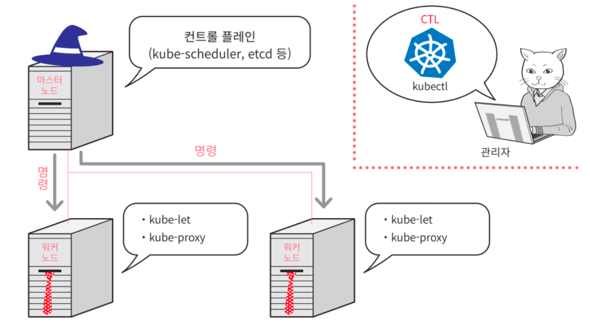

 

## 파드

- 쿠버네티스에서 관리하는 컨테이너 단위
- 컨테이너와 볼륨을 하나로 묶은 것 (볼륨이 없는 경우도 존재함)
- 쿠버네티스에서 생성하고 관리할 수 있는 배포 가능한 가장 작은 컴퓨팅 단위

- 하나의 파드에는 하나 이상의 컨테이너가 존재 (하나의 프로젝트에 - Vue 컨테이너, Spring 컨테이너, MySQL 컨테이너 등이 존재)

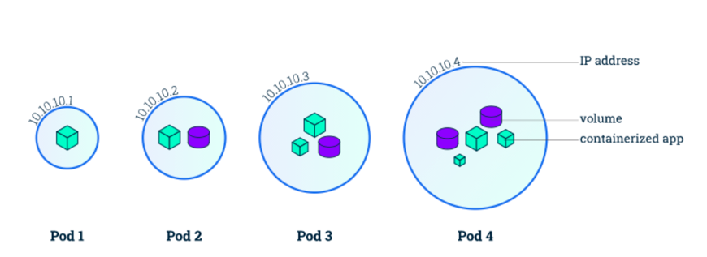

 

## 서비스

- 여러 개의 파드를 하나로 관리
- 서비스가 관리하는 파드는 모두 동일한 구성으로 이루어짐

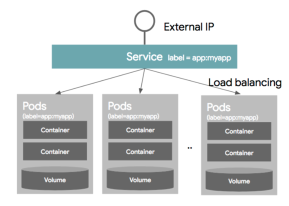

### 서비스의 역할

- 로드밸런서(부하분산) 역할
- 각 서비스는 자동으로 고정된 IP 주소(clusterIP)를 부여받으며, 이 주소로 통신을 함
- 여러 개의 파드로 구성되어도 IP 주소는 1개만 부여함

 

## 레플리카세트 객체

- 파드 수를 관리하는 객체
- 장애 등으로 파드가 종료되었을 때 부족한 파드를 보충하거나 우리가 가진 파일에 파드 수가 감소하면 파드 수를 실제로 감소시킴

- 쿠버네티스가 가지고 있는 여러 장점들 중 TOP3안에 들어가있는 장점을 소개하는 객체

- 레플리카 파드 집합의 실행을 항상 안정적으로 유지함
- 명시된 동일 파드 개수를 일정 수로 유지 및 관리함

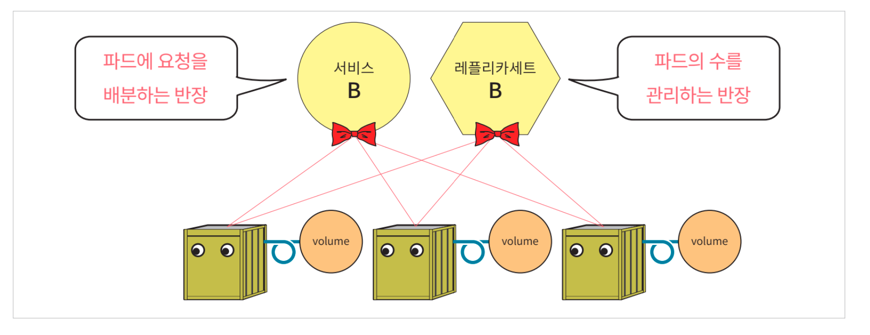

 

# Github Action CI/CD

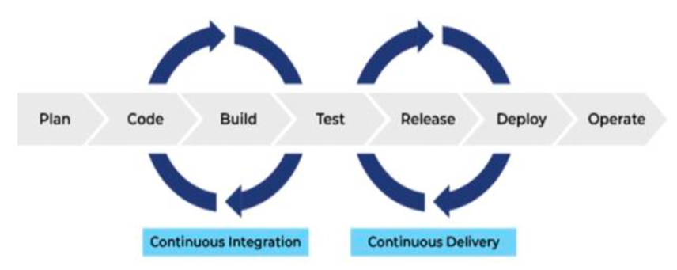

- 매번 개발자가 코드를 수정하고 빌드와 테스트를하고 배포까지 수행한다면 많은 시간이 소요될 것이다 
  하지만 git에 코드를 올리는 것만으로도 빌드와 테스트 및 배포까지 자동화된다면 무의미하게 소요되는 시간을 단축시킬 수 있고
  개발에 보다 더 많은 시간을 투자할 수 있을 것이다

- Github Action, GitLab 으로 CI/CD를 수행할 수 있음

- CI/CD
  - S/W 프로젝트에서 지속적으로 수행해야 하는 반복 작업들

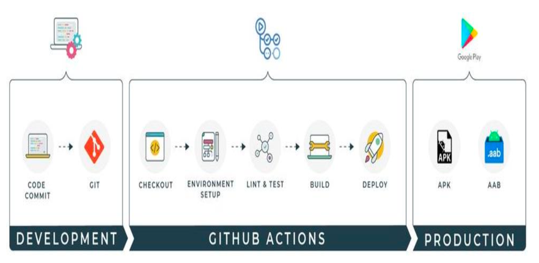

 

## CI (Continuous Integration)

- `빌드 및 테스트 자동화 과정`
- 개발자를 위한 자동화 프로세스인 지속적인 통합(Coninuous Integration)을 뜻함

### CI의 특징

- CI를 성공적으로 구현할 경우, 애플리케이션에 대한 새로운 코드 변경 사항이 정기적으로 빌드 및 테스트 되어 공유 레포지토리에
  통합되므로 여러 명의 개발자가 동시에 애플리케이션 개발과 관련된 코드 작업을 할 경우 서로 충돌할 수 있는 문제를 해결할 수 있음

- 지속적 통합(CI)의 실행은 소스/버전 관리 시스템에 대한 변경 사항을 정기적으로 commit/push하여 모든  사람에게 
동일한 작업 기반을 제공하는 것으로 시작함

- Push할 때마다 빌드와 일련의 자동 테스트가 이루어져서 동작을 확인하고 변경으로 인해 문제가 생기는 부분이 없도록 보장함

 

## CD (Continuous Deployment)

- `배포 자동화 과정`
- 지속적인 서비스 제공(Continuous Delivery) 또는 지속적인 배포(Continuous Deployment)를 뜻함
  (2가지 모두 파이프라인의 추가 단계에 대한 자동화를 뜻하지만 때로는 얼마나 많은 자동화가 이루어지고 있는지를 설명하기 위해 별도로 사용됨)

### CD의 특징

- 코드 변경이 파이프라인의 이전 단계를 모두 성공적으로 통과하면 수동적인 개입 없이 해당 변경 사항이 production에 자동으로 배포됨
- CD를 채택하면 품질 저하 없이 최대한 빨리 사용자에게 새로운 기능을 제공할 수 있음

- 지속적 배포(CD) 성숙하고 입증된 CI(지속적인 통합) 및 지속적인 전달(CD) 단계를 기반으로 함

- 간단한 코드 변경이 정기적으로 마스터에 커밋 및 푸쉬되고, 자동화된 빌드 및 테스트 프로세스를 거치며 다양한 사전 production 환경으로 승격되며, 문제가 발견되지 않으면 최종적으로
배포됨

- 강력하고 신뢰할 수 있는 `자동화 배포 파이프라인을 구축`하면 하루에도 여러 번 이루어지는 배포가 일반적이게 됨

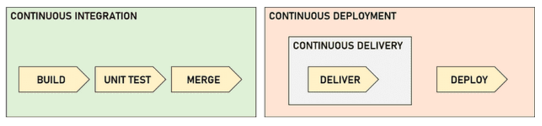

 

## CI/CD 적용 전후 비교

### CI/CD 적용 전

CI/CD를 적용하기 전의 고전적인 코드 통합 과정을 생각해 본다.
1. 개발자들이 개발하여 코드를 수정한다.
2. 각자의 feature 브랜치에 코드를 push한다. (but, 어느 한 부분에서 에러가 났지만 개발자들은 눈치채지 못한다.)
3. 각자의 코드를 git에 올리고 통합(Intergration)한다.
4. 에러가 발생했지만 어느 부분에서 에러가 났는지 모르므로 다시 어디부분에 에러가 있는지 디버 깅하고 코드를 수정한다.
5. (1) ~ (4)의 과정을 반복한다.
6. 많은 시간을 할애하여 에러가 해결되었으면 배포를 시작한다. 하지만 배포과정 또한, 개발자가 직 접 배포과정을 거치므로 많은 시간을 소요한다.

이러한 과정은 코드의 양이 적다면 조금만 시간을 할애해도 에러를 찾아낼 수 있지만, 코드의 양이 많다면 에러 추 적이 안되므로 어마어마한 양의 디버깅 과정을 마주하게 될 수도 있다.

 

### CI/CD 적용 후

이 과정은 하나의 예시일 뿐 다르게 변경할 수도 있다.

1. 개발자들이 개발하여 feature브랜치에 코드를 push한다.
2. `git push를 통해 Trigger되어 CI서버에서 알아서 Build, Test, Lint를 실행하고 결과를 전송`한다. 
3. 개발자들은 결과를 전송받고 에러가 난 부분이 있다면 에러부분을 수정하고 코드를
   master 브랜치에 merge한다.
4. `master 브랜치에 코드를 merge하고 Build, Test가 정상적으로 수행이 되었다면 CI서버에서 알아
   서 Deploy 과정을 수행`한다.

CI/CD를 적용하면 구현에만 집중하고 나머지는 자동화 툴에게 맡기면 된다!
 (개발자의 일을 덜어준다)

 

## GitHub Actions

- 깃허브에서 제공하는 CI/CD 플랫폼
- 깃허브에 소스 코드가 올라오면(push, merge 등이 일어나면) `테스트, 빌드, 도커 이미지 빌드, 도커 허브 업로드, 테스트, 배포, 서버리스를 위한 클라우드로의 업로드 등을 자동화시키는 파이프라인을 구축`할 수 있음

- 깃허브 액션을 사용하여 `자동으로 코드 저장소에서 어떤 이벤트가 발생하였을 때 특정 작업이 일어나게 하거나 주기적으로 어떤 작업들을 반복해서 실행`시킬 수 있음
 

### GitHub Action 구성 요소

#### Event

- 워크플로우 실행을 발동시키는 특정한 활동
- 깃허브에 소스코드를 푸쉬하면 발생하는 `push event`, 머지하면 발생하는 `pull request event`등 깃허브에서 발생하는 대부분의 작업을 `event`로 정의할 수 있음

#### Workflows

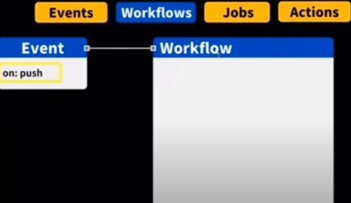

- 자동화하려는 내용을 담고 있는 스크립트 (자동화 해놓은 작업 과정)
- 1개 이상의 job을 실행할 수 있는 자동화된 작업 (워크플로우 내부에는 1개 이상의 Job을 포함함)
- YAML 파일로 저장되며 event 발생시 실행 됨

#### Jobs

- 어떤 이벤트가 발생했을 때 독립된 환경에서 실행되야 하는 일련의 일을
  하나 이상의 작업(job)이 하나의 워크플로우(workflow) 를 구성

- 여러 step들로 구성됨

- 각각의 step들은 일종의 shell script 처럼 실행
  Job은 다른 Job에 의존관계를 가질 수 있으며,
  디폴트는 모든 잡들이 병렬적으로 실행 됨

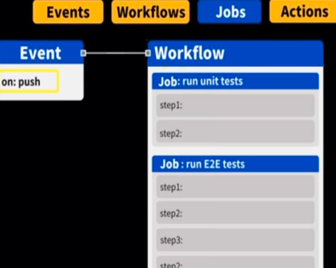

#### Actions

- 복잡하고 자주 반복되는 작업을 정의한 커스텀 애플리케이션 
- 워크플로우 안에서 자주 반복되는 코드를 미리 정의해 코드의 양을 줄일 수 있음
- 깃허브 마켓플레이스를 통해 공용 Action 또는 다른 사람들이 만든 Action을 사용할 수 있음

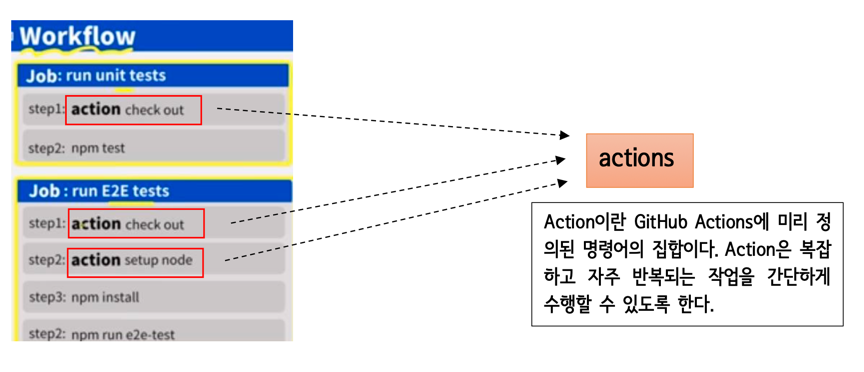

 

## Action의 활용

- 빈번하게 반복되는 step을 재사용하기 용이하도록 GitHub Actions에서 제공하는 일종의 작업 공유 매커니즘
- 이 액션은 하나의 코드 저장소 범위 내에서 여러 워크플로우 간에서 공유를 할 수 있을 뿐만 아니라, 공개 코드 저장소를 통해
액션을 공유하면 GitHub 상의 모든 코드 저장소에서 사용이 가능해짐

 

## 주요 요소들 설명

### name

- workflow의 name을 정의
- 선택사항이며 깃허브 저장소의 깃허브 액션 tab에서 workflow의 이름을 보여줌
- 