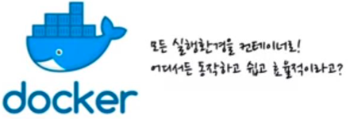
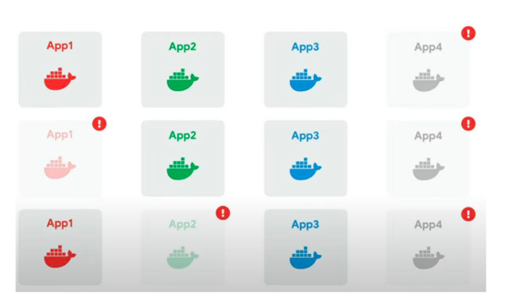
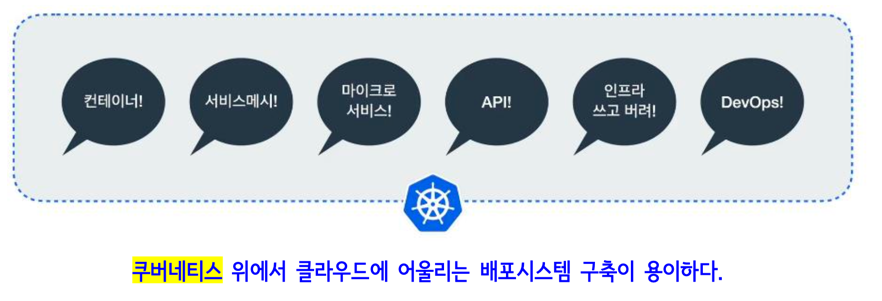

# 쿠버네티스

- 컨테이너를 `쉽고 빠르게 배포 및 확장`하고 `관리를 자동화`해주는 오픈소스 플랫폼

 

## 컨테이너의 특징

- 가상머신과 비교하여 컨테이너 생성이 쉽고 효율적임
- 컨테이너 이미지를 이용한 배포와 롤백이 간단함
- 언어나 프레임워크에 상관없이 애플리케이션을 동일한 방식으로 관리
- 개발/테스팅/운영 환경은 물론 로컬 피시와 클라우드까지 동일한 환경을 구축
- 특정 클라우드 벤더에 종속적이지 않음

MySQL등을 컨테이너화 해서 기동시키는 것을 많이 활용하고 있음
 
- 또한 우리가 구축하고자하는 웹 사이트의 규모에 따라서 여러개의 웹 애플리케이션으로 만들 수 있음 (Micro Service)
  => 유지 보수가 용이함

- springedu, springedu2 등은 각각의 애플리케이션이라 볼 수 있음

 

(가상머신을 이용하는 것은 게스트 운영체제를 추가로 설치해야하므로 저장소도 많이 사용하고 기동할 떄 메모리나 CPU 사용량이 많음)

 

## 컨테이너 구축 과정

1. 개발자가 개발
2. 빌드 (소스를 가지고 뭔가를 수행할 수 있는 구조로 만드는 것)
- 어떤 구성방식이냐에 따라서 빌드 과정이 다름
  - 뷰 프로젝트의 빌드와 스프링부트 프로젝트의 빌드 과정은 다름
  - 여기서의 빌드는 도커 빌드를 뜻함

3. 도커 컨테이너 배포 (도커 컨테이너화)
4. 실행

## 도커 컨테이너 시나리오

- 각각의 앱이 각각의 도커 컨테이너로 구성되어있음

 

- 유저 수가 많아져서 컨테이너를 늘림

- 각 기능을 분산해서 처리할 수 있는 앱들을 늘림
- 기능을 컬러에 맞게 늘리기 위해 (이미지는 이미 있으므로 이미 존재하는 이미지에 맞춰서) 컨테이너만 늘려주면 됨
- 수강생이 요청할 경우 a가 바쁘면 b에게 넘겨주는 방식등으로 작동함

 

- 각각의 일을 하는 컨테이너가 점점 늘어남
- 너무 늘어났으므로 관리가 필요함

 

- 컨테이너를 이용해서 사이트 작업시 관리 작업이 필요해짐

### 컨테이너 시나리오 관련 관리 작업

- 시스템 구축 자동화

 

- `유휴 시스템 파악`

- 문제가 발생한 컨테이너가 발생할 수 있음
- 따라서 모니터링 및 관리해주는 무엇인가가 필요함
- 관리해주는 프로그램이 필요함

 

- `버전 관리`
- 버전 변경을 위해 하나를 죽였을 때 프로그램이 다 죽으면 안되므로 버전을 분리해서 관리

 

- 컨테이너를 외부에 공개하지 않기 위해 Proxy 서버를 둠
- 외부에서는 Proxy 서버에 요청하면 얘가 컨테이너에 요청을 해서 응답을 받고 이를 클라이언트에 전달

 

- 사업이 잘 되어서 서비스하는 컨테이너를 늘림

 

- 앞에 로드밸런서를 두어서 프록시가 로드밸런서에 요청하면 두개의 컨테이너 중 노는 애들에게 요청을 보냄
- 이 과정을 쿠버네티스가 수행해줌

 

- 클라이언트가 도메인 명을 어떻게 주느냐에 따라서 컨테이너에게 어떤 일을 시키느냐에 대한 자동화 과정이 필요함
- 이는 쿠버네티스를 통해 구현이 가능

 

- `서비스 이상, 부하 모니터링`
- 죽은 컨테이너를 감지
- 하나의 컨테이너가 죽으면 다른 애를 자동으로 기동시켜주는 프로그램이 필요함
- 이러한 작업은 쿠버네티스를 통해 실현할 수 있음

 

- 죽은 것은 아니지만 response time이 오래걸리면, status를 죽은것은 아니지만 load가 오래걸리는 작업으로 판단
- 이러한 과정에서 우리가 해주어야하는 컨테이너에 대한 관리가 필요함
- 이때 사용되는 기술이 `컨테이너 오케스트레이션`

 

## 컨테이너 오케스트레이션

- 복잡하고 수많은 컨테이너 환경을 효과적으로 관리하기 위한 제어 체계(도구)
- 컨테이너화 된 애플리케이션에 대한 자동화된 설정, 관리 및 제어 체계

- 오케스트레이션
  - `컴퓨터 자원과 어플리케이션, 서비스에 대한 자동화된 설정, 관리 및 제어 체계`를 뜻함

- 쿠버네티스가 컨테이너 오케스트레이션을 지원함

### 컨테이너 오케스트레이션 지원 툴

이들 중 쿠버네티스가 표준이 되었음

 

## 쿠버네티스의 탄생

- 구글에 의해 생겨남

 

- 수많은 컨테이너의 자동화 및 관리를 담당하는 `컨테이너 오케스트레이션`임

  

## 클라우드 환경에서의 애플리케이션 배포

- `CloudNative`
  - 클라우드 컴퓨팅을 활용하여 "퍼블릭, 프라이빗 및 하이브리 드 클라우드와 같은 현대적이고 역동적인 환경에서 확장 가능한 애플리케이션을 구축하
    고 실행"하는 소프트웨어 개발 접근 방식

 

 

## 쿠버네티스와 클러스터 구축과 동작 방법

규모에 따라 마스터 노드와 워커 노드를 다르게 구성

- 마스터 노드
  - 워커 노드를 관리

- 워커 노드
  - 컨테이너의 수행 담당

 

- 클러스터는 설정 파일의 내용에 따라 자율적으로 동작함

 

## 쿠버네티스의 동작 과정

 

## 파드

- 쿠버네티스에서 관리하는 컨테이너 단위
- 컨테이너와 볼륨을 하나로 묶은 것 (볼륨이 없는 경우도 존재함)
- 쿠버네티스에서 생성하고 관리할 수 있는 배포 가능한 가장 작은 컴퓨팅 단위

- 하나의 파드에는 하나 이상의 컨테이너가 존재 (하나의 프로젝트에 - Vue 컨테이너, Spring 컨테이너, MySQL 컨테이너 등이 존재)

 

## 서비스

- 여러 개의 파드를 하나로 관리
- 서비스가 관리하는 파드는 모두 동일한 구성으로 이루어짐

### 서비스의 역할

- 로드밸런서(부하분산) 역할
- 각 서비스는 자동으로 고정된 IP 주소(clusterIP)를 부여받으며, 이 주소로 통신을 함
- 여러 개의 파드로 구성되어도 IP 주소는 1개만 부여함

 

## 레플리카세트 객체

- 파드 수를 관리하는 객체
- 장애 등으로 파드가 종료되었을 때 부족한 파드를 보충하거나 우리가 가진 파일에 파드 수가 감소하면 파드 수를 실제로 감소시킴

- 쿠버네티스가 가지고 있는 여러 장점들 중 TOP3안에 들어가있는 장점을 소개하는 객체

- 레플리카 파드 집합의 실행을 항상 안정적으로 유지함
- 명시된 동일 파드 개수를 일정 수로 유지 및 관리함

 

# Github Action CI/CD

- 매번 개발자가 코드를 수정하고 빌드와 테스트를하고 배포까지 수행한다면 많은 시간이 소요될 것이다 
  하지만 git에 코드를 올리는 것만으로도 빌드와 테스트 및 배포까지 자동화된다면 무의미하게 소요되는 시간을 단축시킬 수 있고
  개발에 보다 더 많은 시간을 투자할 수 있을 것이다

- Github Action, GitLab 으로 CI/CD를 수행할 수 있음

## CI (Continuous Integration)

- `빌드 및 테스트 자동화 과정`
- 개발자를 위한 자동화 프로세스인 지속적인 통합(Coninuous Integration)을 뜻함

### CI의 특징

- CI를 성공적으로 구현할 경우, 애플리케이션에 대한 새로운 코드 변경 사항이 정기적으로 빌드 및 테스트 되어 공유 레포지토리에
  통합되므로 여러 명의 개발자가 동시에 애플리케이션 개발과 관련된 코드 작업을 할 경우 서로 충돌할 수 있는 문제를 해결할 수 있음

- 지속적 통합(CI)의 실행은 